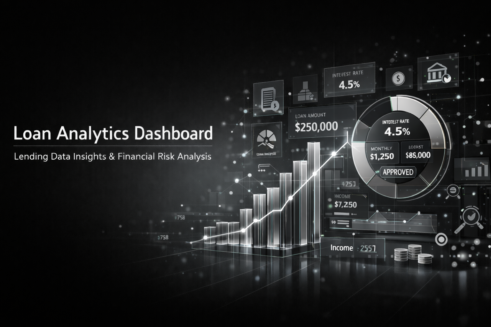
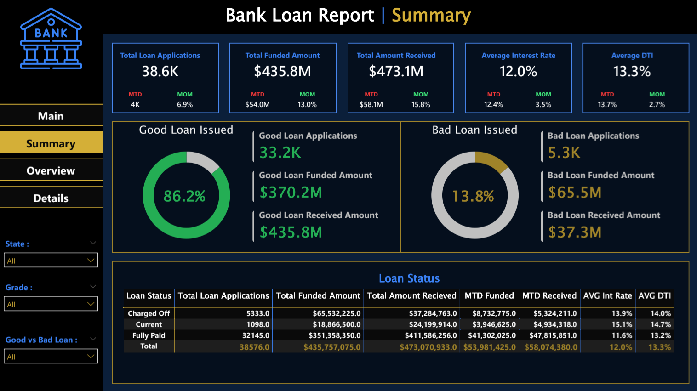
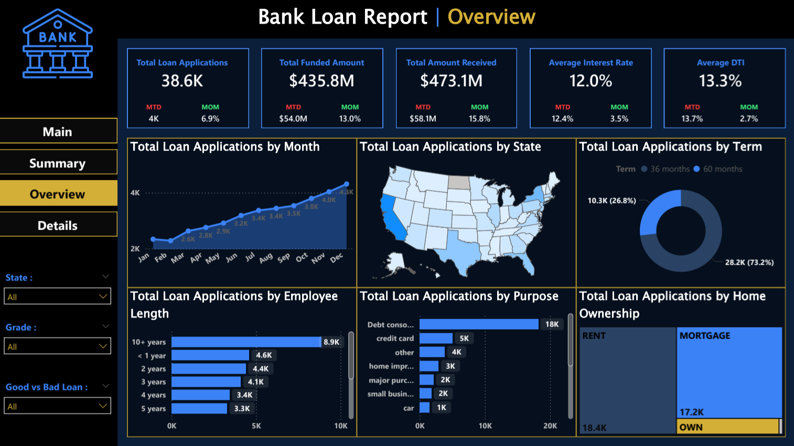
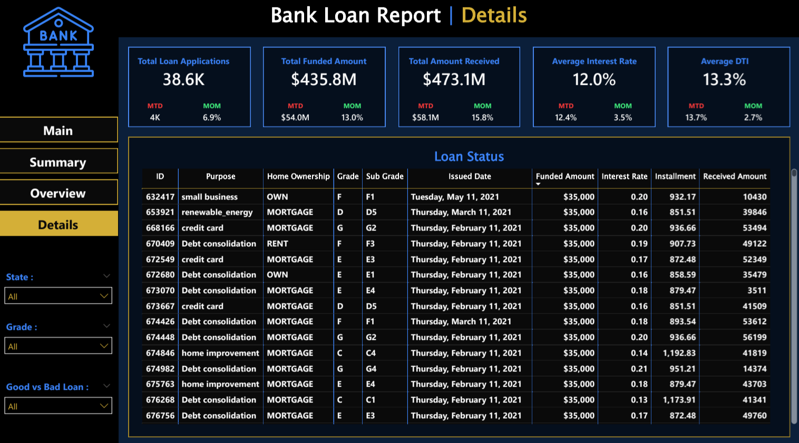

# 🏦 Bank Loan Data Analysis — Power BI Dashboard

A multi-page Power BI report built to move beyond static loan summaries and surface the real dynamics behind lending performance, borrower behavior, and portfolio health.

---

## 📌 Problem Statement

Traditional reporting methods often present loan data as flat numbers — total applications, total funded, done. That approach hides the patterns that matter: which borrower profiles are driving defaults, how loan performance shifts month over month, and what the distribution of risk actually looks like across the portfolio.

This project addresses that gap by building a suite of interconnected dashboards that let decision-makers explore the data at multiple levels of granularity — from high-level KPIs down to individual loan records.

---

## 🎯 Objective

Design and build a dynamic Power BI report that delivers a comprehensive view of:
- Lending operations and portfolio health
- Borrower demographics and financial behavior
- Loan performance segmented by status, grade, purpose, and geography
- Month-over-month trends for proactive decision-making

---

## 📊 Dashboard Pages

### 1 — Summary
High-level KPIs with MTD and MoM tracking.

| Metric | Value |
|---|---|
| Total Loan Applications | 38,576 |
| Total Funded Amount | $435.8M |
| Total Amount Received | $473.1M |
| Average Interest Rate | 12.05% |
| Average DTI | 13.33% |

**Good vs. Bad Loan breakdown:**

| Category | Applications | Funded Amount | Received Amount |
|---|---|---|---|
| Good Loans (86.2%) | 33,243 | $370.2M | $435.8M |
| Bad Loans (13.8%) | 5,333 | $65.5M | $37.3M |

**Loan Status Table:**

| Status | Applications | Funded | Received | Avg Interest | Avg DTI |
|---|---|---|---|---|---|
| Fully Paid | 32,145 | $351.4M | $411.6M | 11.64% | 13.17% |
| Charged Off | 5,333 | $65.5M | $37.3M | 13.88% | 14.00% |
| Current | 1,098 | $18.9M | $24.2M | 15.10% | 14.72% |

---

### 2 — Overview
Trend and distribution analysis across multiple dimensions.

- **By Month** — steady growth from 2.3K in January to 4.3K in December
- **By State** — geographic heatmap showing application concentration across the US
- **By Term** — 73.2% on 36-month terms vs. 26.8% on 60-month terms
- **By Employment Length** — borrowers with 10+ years of employment lead at 8.9K applications
- **By Purpose** — debt consolidation dominates at ~18K applications, followed by credit card refinancing (5K)
- **By Home Ownership** — renters (18.4K) and mortgage holders (17.2K) make up the majority of applicants

---

### 3 — Details
A fully filterable record-level table showing individual loan entries with:
- Loan ID, Purpose, Home Ownership
- Grade and Sub-Grade
- Issue Date, Funded Amount, Interest Rate
- Monthly Installment, Total Amount Received

---

## 🔍 Key Analytical Finding

When comparing charged-off loans against fully paid ones, a clear pattern emerges:

> Charged-off loans carry a **13.88% average interest rate** and **14.00% DTI**, compared to **11.64% interest** and **13.17% DTI** for fully paid loans.

This reflects **Risk-Based Pricing** in practice — the bank correctly identifies higher-risk borrowers and prices accordingly. However, the higher financial burden that comes with elevated rates appears to contribute to the very defaults it was meant to compensate for. It's a structural tension worth monitoring at the portfolio level.

---

## 📸 Dashboard Preview

### Summary

### Overview

### Details

---

## 🗂️ Repository Contents

| File | Description |
|---|---|
| `bank.pbix` | Power BI report file |
| `financial_loan.csv` | Raw loan dataset |
| `Bank_Analysis.pdf` | Dashboard screenshots and documentation |
| `bankTheme.json` | Custom Power BI theme used in the report |
| `Media/` | Supporting assets |

---

## 🛠️ Tools Used

- **Power BI Desktop** — report building, DAX measures, data modeling
- **DAX** — custom KPIs including MTD, MoM, Good/Bad loan classification
- **CSV** — raw data source with 38K+ loan records

---

## 📁 How to Use

1. Clone or download the repository
2. Open `bank.pbix` in Power BI Desktop
3. If prompted, reconnect `financial_loan.csv` as the data source
4. Apply `bankTheme.json` via View → Themes for the correct visual styling
5. Use the slicers (State, Grade, Good vs Bad Loan) to explore the data interactively

---

## 👤 Author

**Roayda**
[GitHub Profile](https://github.com/Roayda)
